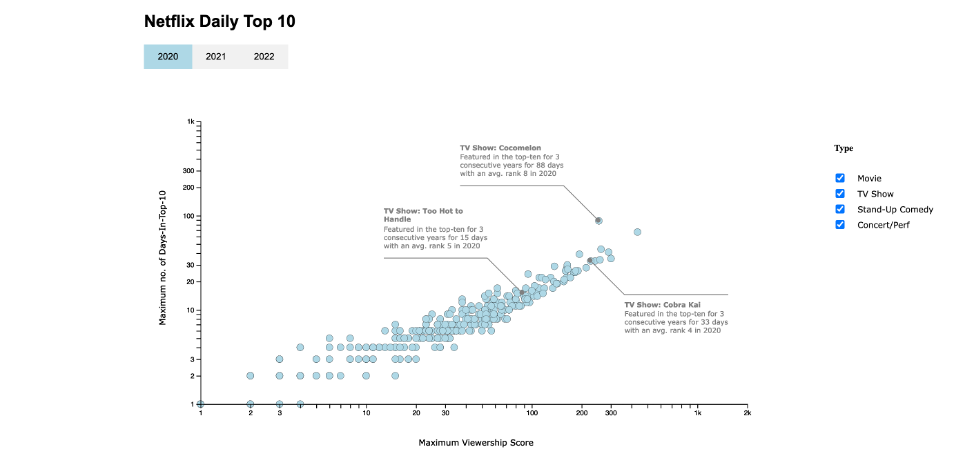
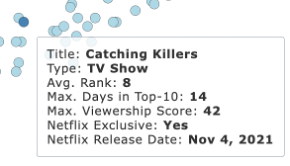

# ropalkar.github.io

Narrative Project for CS-416 Data Visualisation Summer 2022

# Netflix Daily Top 10

## **Netflix Daily Top 10 Movie/TV Show in the United States from 2020 - Mar 2022**

Netflix, one of the popular streaming services on the internet, offers a wide variety of TV Shows, Movies etc. The above visualization captures the shows that have featured in the Daily-Top-10 list for all show types in the United States from the year 2020 up to March 2022.

The dataset has been sourced from kaggle open-source datasets: [kaggle.com - netflix-daily-top-10-in-us](https://www.kaggle.com/datasets/prasertk/netflix-daily-top-10-in-us)

## Viewership Score vs Daily-Top-10

Every show that has featured in the “Daily-Top-10” list has an associated viewership-score, number of days the show has been featured in ‘daily-top-10’ and the rank for every day from 2020 to 2022. The number of days is incremented by 1 for every day the show is featured in the ‘daily-top-10’ list.

> The visualization helps in identifying the most viewed and popular shows on Netflix based on the cumulative scores across the last 3 years.

The above visualization presents the shows in an increasing value of the parameters and thus the most viewed and popular shows brew up towards the right in this scatter-plot visualization which maps the maximum value of the viewership-score to the maximum number of days a show is present in the ‘daily-top-10’ list. The viz also provides additional information as the show-type, the average rank of the show and Netflix release date related details. The shows can also be filtered by the show-type, for e.g., if it’s a movie or a tv-show etc.

## Daily-Top-10 Hat-Trick

Some of the most viewed & popular Netflix shows have featured in the Daily-Top-10 list over 3 consecutive years, from 2020 to 2022. The viewership-score and the days-in-daily-top-10 represents the cumulative trend of the parameters over the years. The following shows maintained a lead and were observed to have a ‘Daily-Top-10’ Hat-Trick across the last 3 years:

1. Cocomelon: A tv-show that has maintained a big lead for over 400 days, with a maximum viewership score of above 1400.
2. Cobra Kai: Another tv-show with a maximum viewership score of above 500.
3. Too Hot to Handle: A Netflix Exclusive show that reached a viewership score of around 300.
